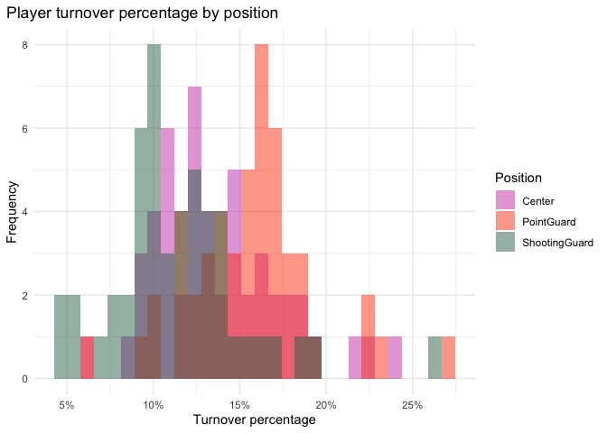
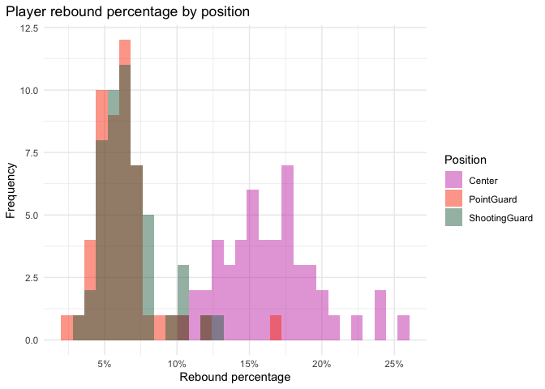
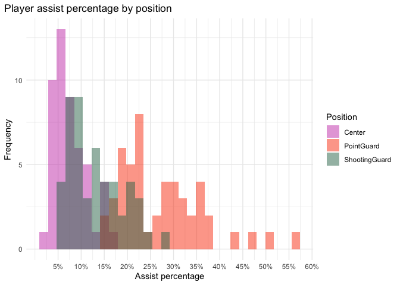
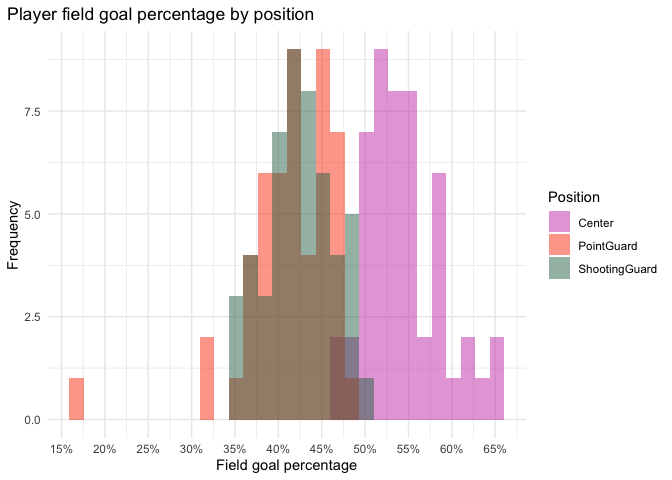

<!-- README.md is generated from README.Rmd. Please edit that file -->

# NBA positions dataset

<!-- badges: start -->

<!-- badges: end -->

This repository contains the NBA positions dataset. The main dataset is
designed to replace the iris dataset and contains basic statistics about
150 NBA Centers, Point Guards and Shooting Guards from 2017. There is a
also a expanded dataset (`nba_positions_full`) the includes the same
statistics for all NBA players in 2017.

## Source

The source file for creating this dataset was obtained from Kaggle at
<https://www.kaggle.com/drgilermo/nba-players-stats/data?select=Seasons_Stats.csv>
which was originally scraped from [Basketball
Reference](http://www.basketball-reference.com/ "Basketball Reference").

If you use this dataset please acknowledge the Kaggle dataset and
Basketball Reference (following the [instructions
here](https://www.basketball-reference.com/about/contact.html "Basketball Reference Contact")).

## Processing

Here is a brief description of how the dataset was created but see
`nba_positions.R` for details:

1.  Read the Kaggle dataset
2.  Select rows where `Year == 2017`
3.  Select columns containing player, team, games played, positions,
    turnover percentage, rebound percentage, assist percentage and field
    goal percentage
4.  Scale field goal percentage to the range 0-100 to match other
    statistics (this is the `nba_positions_full` dataset)
5.  Summarise statistics for players who played on multiple teams in
    2017
6.  Select Centers, Point Guards and Shooting Guards who played more
    than 10 games
7.  Cluster the players using k-means with three clusters
8.  Select 50 Centers that are most like their cluster, 50 random Point
    Guards and 50 random Shooting Guards

# Summary

Their are two TSV files. The `nba_positions.tsv` file contains the
dataset most similar to the iris data.

  - **nba\_positions.tsv** 150 selected NBA players with these columns:
      - `Position` - playing position (“Center”, “PointGuard” or
        “ShootingGuard”)
      - `TurnoverPct` - turnover percentage
      - `ReboundPct` - rebound percentage
      - `AssistPct` - assist percentage
      - `FieldGoalPct` - field goal percentage
  - **nba\_positions\_full.tsv** all NBA players in 2017 with these
    *additional* columns:
      - `Player` - player name
      - `Team` - team name
      - `Games` - games played

## Distributions

Example plots showing distributions of the different statistics.

### Turnover percentage

<!-- -->

### Rebound percentage

<!-- -->

### Assist percentage

<!-- -->

### Field goal percentage

<!-- -->
